# 🤖 MCP Chatbot Client

<div align="center">

### **Connect Claude AI to Unlimited MCP Servers**

A production-ready Python chatbot leveraging the **Model Context Protocol** to dynamically discover and use tools from any MCP-compatible server.

[](https://www.python.org/downloads/)
[](https://modelcontextprotocol.io)
[](https://opensource.org/licenses/MIT)
[](https://github.com/psf/black)

[Features](#-features) •
[Quick Start](#-quick-start) •
[Architecture](#-architecture) •
[Usage](#-usage) •
[Configuration](#-configuration) •
[Contributing](#-contributing)

</div>

---

## 🎯 The Problem MCP Solves

### Before MCP: The M×N Integration Problem


### With MCP: The M+N Solution


> **MCP is like USB for AI** - a universal standard that makes AI integrations plug-and-play!

---

## ✨ Features

<table>
<tr>
<td width="50%">

### 🔌 **Multi-Server Architecture**

Connect to unlimited MCP servers simultaneously with dynamic discovery

### 🎯 **Zero Configuration**

Add new servers via JSON config - no code changes needed

### 🤖 **Claude AI Powered**

Leverages Anthropic's latest models with tool calling

</td>
<td width="50%">

### ⚡ **AsyncExitStack Pattern**

Scalable async architecture for production use

### 🛡️ **Robust & Resilient**

Individual server failures don't crash the application

### 🔒 **Secure by Design**

Environment variables, sandboxed file access, API key protection

</td>
</tr>
</table>

---

## 🏗️ Architecture

### System Overview

```mermaid
flowchart TB
    User([👤 User])

    subgraph ChatBot["🤖 MCP Chatbot Client"]
        Config[📋 Load server_config.json]
        Launch[🚀 Launch MCP Servers]
        Discover[🔍 Discover Tools]
        Chat[💬 Interactive Chat Loop]

        Config --> Launch
        Launch --> Discover
        Discover --> Chat
    end

    subgraph Servers["MCP Servers (Subprocesses)"]
        FS[📁 Filesystem Server<br/>Node.js via npx]
        Fetch[🌐 Fetch Server<br/>Python via uvx]
        Custom[🔧 Custom Servers<br/>Your tools]
    end

    subgraph Claude["🧠 Claude AI"]
        API[Anthropic API<br/>claude-sonnet-4]
    end

    User <-->|Natural Language| Chat
    Chat <-->|Messages + Tools| API
    Chat -->|Tool Calls| FS
    Chat -->|Tool Calls| Fetch
    Chat -->|Tool Calls| Custom

    FS -->|Results| Chat
    Fetch -->|Results| Chat
    Custom -->|Results| Chat

    style ChatBot fill:#e3f2fd,stroke:#1976d2,stroke-width:2px
    style Servers fill:#f3e5f5,stroke:#7b1fa2,stroke-width:2px
    style Claude fill:#fff3e0,stroke:#f57c00,stroke-width:2px
    style User fill:#e8f5e9,stroke:#388e3c,stroke-width:2px
```



### Conversation Flow

```mermaid
sequenceDiagram
    participant User
    participant Chatbot
    participant Claude
    participant MCPServer as MCP Server<br/>(filesystem)

    User->>Chatbot: "Read the README.md file"

    Chatbot->>Claude: Send message + available tools
    Note over Claude: Analyzes request<br/>Decides to use read_file

    Claude->>Chatbot: Tool call: read_file(path="README.md")

    Chatbot->>MCPServer: Execute: read_file
    Note over MCPServer: Reads file from disk

    MCPServer->>Chatbot: File content

    Chatbot->>Claude: Tool result + content
    Note over Claude: Processes result<br/>Generates response

    Claude->>Chatbot: Final response

    Chatbot->>User: "I've read your README..."

    rect rgb(200, 255, 200)
    Note over User,MCPServer: ✅ Complete conversation with tool usage
    end
```



---

## 🚀 Quick Start

### Prerequisites

- **Python 3.13+**
- **Node.js 18+** (for npx-based servers)
- **[uv](https://github.com/astral-sh/uv)** package manager
- **[Anthropic API Key](https://console.anthropic.com/)**

### Installation

```bash
# Clone the repository
git clone https://github.com/yourusername/mcp-chatbot-client.git
cd mcp-chatbot-client

# Install dependencies
uv sync

# Configure API key
echo "ANTHROPIC_API_KEY=your_api_key_here" > .env

# Run!
uv run python main.py
```

### First Run Output

```
🚀 Setting up MCP Chatbot...
==================================================
✅ Loaded configuration from server_config.json
📋 Found 2 server(s)

🔌 Connecting to 'filesystem' server...
✅ Connected to 'filesystem' with 3 tool(s)

🔌 Connecting to 'fetch' server...
✅ Connected to 'fetch' with 1 tool(s)

==================================================
✅ Setup complete! 4 total tools available
==================================================

🤖 MCP Chatbot Ready!

You: _
```

---

## 💬 Usage

### Interactive Commands

| Command              | Description                                     |
| -------------------- | ----------------------------------------------- |
| `tools`              | View all available tools from connected servers |
| `quit` or `exit`     | Gracefully exit the chatbot                     |
| `<natural language>` | Chat with Claude using MCP tools                |

### Example Conversations

#### 📖 Read a File

```
You: Read the README.md file

🔧 Calling tool 'read_file' with args: {'path': 'README.md'}
✅ Tool executed

Claude: I've read your README.md file. It describes an MCP chatbot
        client that connects Claude AI to external MCP servers...
```

#### 🌐 Fetch Web Content

```
You: Fetch https://www.anthropic.com and summarize the content

🔧 Calling tool 'fetch' with args: {'url': 'https://www.anthropic.com'}
✅ Tool executed

Claude: Anthropic is an AI safety company. Their website describes their
        mission to build reliable, interpretable, and steerable AI systems...
```

#### 📝 Multi-Step Operations

```
You: List all Python files in this directory, then create a summary document

🔧 Calling tool 'list_directory' with args: {'path': '.'}
✅ Tool executed

🔧 Calling tool 'write_file' with args: {'path': 'summary.txt', ...}
✅ Tool executed

Claude: I've analyzed the directory and created summary.txt with details
        about all 3 Python files found...
```

---

## ⚙️ Configuration

### Server Configuration File

Create `server_config.json` in your project root:

```json
{
  "mcpServers": {
    "filesystem": {
      "command": "npx",
      "args": ["-y", "@modelcontextprotocol/server-filesystem", "."],
      "env": {}
    },
    "fetch": {
      "command": "uvx",
      "args": ["--quiet", "mcp-server-fetch"],
      "env": {}
    }
  }
}
```

### Configuration Schema


### Adding More Servers

**Just update the JSON - no code changes needed!**

```json
{
  "mcpServers": {
    "filesystem": {...},
    "fetch": {...},
    "brave-search": {
      "command": "npx",
      "args": ["-y", "@modelcontextprotocol/server-brave-search"],
      "env": {
        "BRAVE_API_KEY": "your_api_key"
      }
    },
    "github": {
      "command": "npx",
      "args": ["-y", "@modelcontextprotocol/server-github"],
      "env": {
        "GITHUB_TOKEN": "your_token"
      }
    }
  }
}
```

### Available MCP Servers

Explore the **[MCP Server Registry](https://github.com/modelcontextprotocol/servers)**:

| Server              | Description                         | Provider  |
| ------------------- | ----------------------------------- | --------- |
| 📁 **filesystem**   | File operations (read, write, list) | Anthropic |
| 🌐 **fetch**        | Web content as markdown             | Anthropic |
| 🔍 **brave-search** | Web search                          | Anthropic |
| 🐙 **github**       | Repository management               | Anthropic |
| 📊 **sqlite**       | Database queries                    | Anthropic |
| 💬 **slack**        | Team communication                  | Community |
| 🐘 **postgres**     | PostgreSQL access                   | Community |

---

## 🎨 Key Design Patterns

### AsyncExitStack Pattern

**The Problem:** Can't dynamically manage async contexts in a loop with nested `async with` blocks.

**The Solution:**

```mermaid
graph LR
    subgraph "Traditional Nested (❌ Doesn't Scale)"
        N1[async with server1:]
        N2[async with server2:]
        N3[async with server3:]
        N1 --> N2
        N2 --> N3
        N3 --> Loop1[chat_loop]

        Note1[Nesting depth = # of servers]

        style N1 fill:#ffebee
        style N2 fill:#ffebee
        style N3 fill:#ffebee
        style Note1 fill:#ffebee,stroke:#c62828
    end

    subgraph "AsyncExitStack (✅ Scalable)"
        S1[async with AsyncExitStack]
        S2[for server in servers:<br/>stack.enter_async_context]
        S1 --> S2
        S2 --> Loop2[chat_loop]

        Note2[Constant depth = 2<br/>Unlimited servers!]

        style S1 fill:#e8f5e9
        style S2 fill:#e8f5e9
        style Loop2 fill:#e8f5e9
        style Note2 fill:#e8f5e9,stroke:#2e7d32
    end
```



**Implementation:**

```python
async def connect_to_servers_and_run(self):
    async with AsyncExitStack() as stack:
        # Dynamically add unlimited servers
        for server_name, config in servers.items():
            read, write = await stack.enter_async_context(
                stdio_client(server_params)
            )
            session = await stack.enter_async_context(
                ClientSession(read, write)
            )
            # All contexts stay alive!

        # Run chat with all servers connected
        await self.chat_loop()
```

---

## 💰 Cost Optimization

### Model Comparison

```mermaid
graph TB
    subgraph Models["Claude Models"]
        Haiku[⚡ Haiku 4.5<br/>$1 / $5 per MTok<br/>Fast & Cheap]
        Sonnet[🚀 Sonnet 4.5<br/>$3 / $15 per MTok<br/>Balanced]
        Opus[🎯 Opus 4<br/>$15 / $75 per MTok<br/>Premium]
    end

    subgraph Usage["Use Cases"]
        Dev[🧪 Testing &<br/>Development]
        Prod[🏭 Production<br/>Applications]
        Premium[💎 Critical<br/>Tasks]
    end

    Haiku -.->|Recommended| Dev
    Sonnet -.->|Recommended| Prod
    Opus -.->|Recommended| Premium

    style Haiku fill:#e8f5e9,stroke:#2e7d32,stroke-width:2px
    style Sonnet fill:#e3f2fd,stroke:#1976d2,stroke-width:2px
    style Opus fill:#f3e5f5,stroke:#7b1fa2,stroke-width:2px

    Note[💡 Haiku is 67% cheaper than Sonnet!]
    style Note fill:#fff3e0,stroke:#f57c00,stroke-width:2px
```



### Switching Models

In `chatbot.py`, update the model parameter (appears in 2 locations):

```python
# For testing (cheaper):
model='claude-haiku-4-5-20251001'

# For production (better quality):
model='claude-sonnet-4-20250514'
```

**Cost Savings Example:**

- 1000 queries with Haiku: ~$10
- 1000 queries with Sonnet: ~$30
- **Savings: $20 (67% cheaper!)**

---

## 📁 Project Structure

```
mcp-chatbot-client/
│
├── 📄 chatbot.py              # Core MCP chatbot implementation
├── 📄 main.py                 # Application entry point
│
├── ⚙️  server_config.json     # MCP server configuration
├── 🔐 .env                    # API keys (gitignored)
│
├── 📋 pyproject.toml          # Python dependencies
├── 🔒 uv.lock                 # Locked dependency versions
│
├── 📖 README.md               # This file
└── 📘 GUIDE.md                # Detailed learning guide
```

---

## 🧪 Development

### Testing Individual Servers

```bash
# Test filesystem server
npx -y @modelcontextprotocol/server-filesystem .

# Test fetch server
uvx --quiet mcp-server-fetch
```

### Building Custom MCP Servers

```python
from mcp.server.fastmcp import FastMCP

mcp = FastMCP("my-custom-server")

@mcp.tool()
def process_text(text: str) -> str:
    """Process text and return result"""
    return f"Processed: {text.upper()}"

if __name__ == "__main__":
    mcp.run()
```

Add to config:

```json
{
  "my-server": {
    "command": "uv",
    "args": ["run", "my_server.py"]
  }
}
```

---

## 🐛 Troubleshooting

### Common Issues

<details>
<summary><b>❌ "ANTHROPIC_API_KEY not found"</b></summary>

**Solution:**

```bash
# Create .env file with your key
echo "ANTHROPIC_API_KEY=sk-ant-..." > .env

# Verify it's not tracked by git
git status  # .env should not appear
```

</details>

<details>
<summary><b>❌ "npx: command not found"</b></summary>

**Solution:**

```bash
# Ubuntu/Debian
sudo apt install nodejs npm

# macOS
brew install node

# Windows
# Download from nodejs.org
```

</details>

<details>
<summary><b>❌ "Failed to parse JSONRPC message"</b></summary>

**Solution:**
Add `--quiet` flag to suppress npm output:

```json
{
  "fetch": {
    "command": "uvx",
    "args": ["--quiet", "mcp-server-fetch"]
  }
}
```

</details>

---

## 🤝 Contributing

We welcome contributions! Here's how to get involved:

```mermaid
graph LR
    A[🍴 Fork Repo] --> B[🌿 Create Branch]
    B --> C[💻 Make Changes]
    C --> D[✅ Test Changes]
    D --> E[📝 Commit]
    E --> F[⬆️ Push]
    F --> G[🔄 Open PR]

    style A fill:#e8f5e9,stroke:#2e7d32
    style B fill:#e3f2fd,stroke:#1976d2
    style C fill:#fff3e0,stroke:#f57c00
    style D fill:#f3e5f5,stroke:#7b1fa2
    style E fill:#fce4ec,stroke:#c2185b
    style F fill:#e0f2f1,stroke:#00897b
    style G fill:#e8eaf6,stroke:#3949ab
```



### Ways to Contribute

- 🐛 **Report Bugs** - Open detailed issues
- 💡 **Suggest Features** - Share your ideas
- 📖 **Improve Documentation** - Help others learn
- 🔧 **Submit Pull Requests** - Fix bugs, add features
- ⭐ **Star the Repository** - Show your support

### Code Guidelines

- Follow **PEP 8** style guide
- Add **type hints** to functions
- Include **docstrings** for classes and methods
- Write **clear commit messages**
- Add **tests** for new features

---

## 📚 Resources

### Official Documentation

| Resource                                                           | Description                     |
| ------------------------------------------------------------------ | ------------------------------- |
| [MCP Docs](https://modelcontextprotocol.io/docs)                   | Complete protocol specification |
| [Python SDK](https://github.com/modelcontextprotocol/python-sdk)   | Official Python implementation  |
| [Anthropic API](https://docs.anthropic.com)                        | Claude API documentation        |
| [Server Registry](https://github.com/modelcontextprotocol/servers) | Available MCP servers           |

### Learning Resources

- 🎓 [DeepLearning.AI Course](https://learn.deeplearning.ai/courses/mcp-build-rich-context-ai-apps-with-anthropic) - Complete MCP course
- 📖 [MCP Quickstart](https://modelcontextprotocol.io/quickstart/client) - Get started quickly
- 💬 [Community Forum](https://github.com/orgs/modelcontextprotocol/discussions) - Ask questions

---

## 🎓 What You'll Learn


---

## 📊 Project Stats

<div align="center">

| Metric                | Value               |
| --------------------- | ------------------- |
| **Lines of Code**     | ~200                |
| **Dependencies**      | 4 core packages     |
| **Supported Servers** | Unlimited ♾️        |
| **Tool Discovery**    | Automatic 🤖        |
| **Setup Time**        | < 5 minutes ⚡      |
| **Scalability**       | Production-ready 🚀 |

</div>

---

## 📝 License

This project is licensed under the **MIT License** - see the [LICENSE](LICENSE) file for details.

---

## 🙏 Acknowledgments

- **[Anthropic](https://www.anthropic.com/)** - For Claude AI and the MCP protocol
- **[DeepLearning.AI](https://www.deeplearning.ai/)** - For the comprehensive MCP course
- **MCP Community** - For reference implementations and community servers
- **Contributors** - Thank you for improving this project!

---

## 🌟 Star History

<div align="center">

**If this project helped you, please star it! ⭐**

It helps others discover the project and motivates continued development.

[](https://star-history.com/#jorgegoco/mcp-chatbot-client&Date)

</div>

---

## 📬 Support & Contact

<div align="center">

| Channel            | Link                                                                                                                                       |
| ------------------ | ------------------------------------------------------------------------------------------------------------------------------------------ |
| 🐛 **Issues**      | [GitHub Issues](https://github.com/jorgegoco/mcp-chatbot-client/issues)                                                                    |
| 💬 **Discussions** | [GitHub Discussions](https://github.com/jorgegoco/mcp-chatbot-client/discussions)                                                          |
| 📧 **Email**       | jorgegoco70@gmail.com                                                                                                                      |
| 🎓 **Course**      | [MCP: Build Rich-Context AI Apps with Anthropic](https://www.deeplearning.ai/short-courses/mcp-build-rich-context-ai-apps-with-anthropic/) |

</div>

---

<div align="center">

**Built with ❤️ using the Model Context Protocol**

**MCP is USB for AI - One Protocol, Unlimited Possibilities**

[⬆ Back to Top](#-mcp-chatbot-client)

</div>
